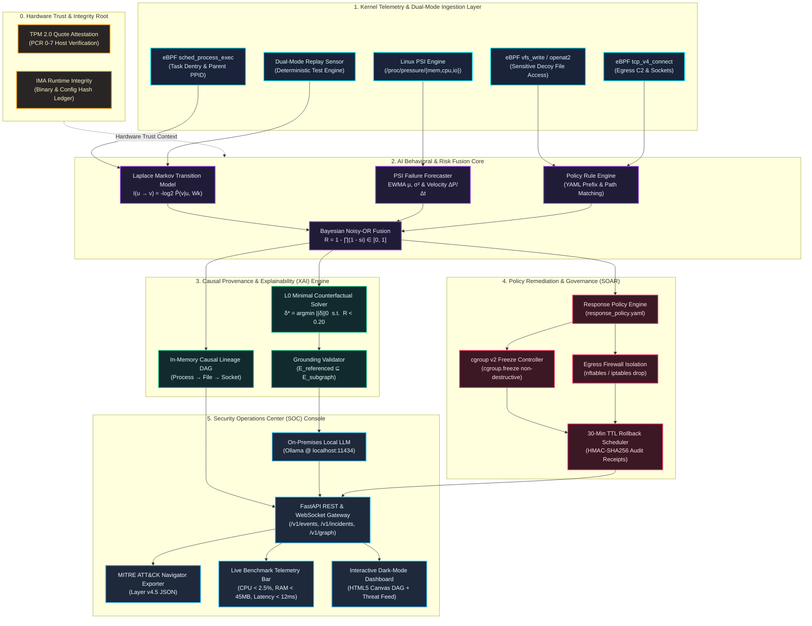

# ⚡ वज्र (Vajra) — System Architecture Diagram Specification
**Project**: `7. वज्र (Vajra)` | **Team**: `Team_Red_Eagle`  
**Problem Statement**: *AI-Powered Explainable Linux Security Assistant for Kernel-Level Intrusion & Behavioral Threat Detection*

---

## 🎯 Architecture Overview

This document provides the complete structural architecture and data-flow diagrams for **वज्र (Vajra)**. You can copy the Mermaid code below into [mermaid.live](https://mermaid.live) or your markdown previewer to export an official high-resolution **PNG/JPEG (under 300KB)** for your hackathon submission.

---

## 📊 1. End-to-End System Architecture Diagram

---

## 🔄 2. Real-Time Streaming Data Flow

```mermaid
sequenceDiagram
    autonumber
    participant K as Linux Kernel (eBPF / PSI)
    participant S as Sensor & Replay Agent
    participant D as AI Detection Engine
    participant G as Provenance Lineage DAG
    participant X as XAI & Grounding Validator
    participant R as Policy Remediation & Rollback
    participant U as Web Dashboard & SOC Analyst

    K->>S: Kernel Event (execve, openat2, connect, PSI pressure)
    S->>D: Ingest Event + Hardware Trust Context
    
    rect rgb(20, 25, 45)
        Note over D: Multi-Signal AI Evaluation
        D->>D: 1. Evaluate Deterministic Rules
        D->>D: 2. Calculate Markov Spawning Surprisal (-log2 P)
        D->>D: 3. Forecast PSI Resource Pressure Velocity
        D->>D: 4. Bayesian Noisy-OR Fusion (Risk Score R)
    end

    D->>G: Ingest Node/Edge & Update Execution DAG
    D->>X: Synthesize L0 Minimal Counterfactual Perturbations
    X->>X: Validate Entity Grounding (E_ref ⊆ E_subgraph)
    
    alt Threat Score R >= 0.90 (Autonomous Containment Allowed)
        D->>R: Execute Non-Destructive cgroup.freeze & Block Egress
        R->>R: Issue HMAC-SHA256 Receipt & Start 30-min Auto-Rollback TTL
    end

    D->>U: Stream Incident, Subgraph, and Live Metrics to UI
    U->>X: Analyst Inquires: "Why was this flagged?"
    X-->>U: Return Verified Natural-Language Counterfactual Explanation
```

---

## 📦 3. Subsystem Component Breakdown

| Layer | Subsystem | File Location | Key Responsibility |
| :--- | :--- | :--- | :--- |
| **0. Trust** | Hardware Attestation | `contracts/` | Validates TPM 2.0 PCR quotes and IMA runtime binary hashes (`TrustContext`). |
| **1. Sensing** | eBPF & Telemetry Sensor | `bpf/`, `agent/` | Captures process executions, file writes, network sockets, and `/proc/pressure` metrics with zero kernel modification. |
| **2. AI Core** | Multi-Signal Risk Engine | `services/detector/app/` | Computes Laplace-smoothed Markov surprisal, EWMA resource pressure forecasting, and Bayesian Noisy-OR fusion. |
| **3. XAI** | Causal DAG & Counterfactuals | `services/graph/`, `counterfactual.py` | Solves $L_0$-minimal feature perturbation and constructs provenance Directed Acyclic Graphs. |
| **4. SOAR** | Policy Engine & Rollback | `services/responder/app/` | Manages `cgroup.freeze`, `nftables` isolation, and 30-minute auto-rollback with HMAC-SHA256 audit receipts. |
| **5. Assistant** | Grounded SOC Interface | `services/api/app/`, `ui/` | Provides local on-premises LLM chat with mechanical grounding validation, live DAG visualizer, and MITRE export. |

---

## 🖼️ How to Export PNG/JPG for Hackathon Upload (Max 300KB)

1. Open **[mermaid.live](https://mermaid.live)** in your browser.
2. Copy and paste the Mermaid code from **Section 1** into the editor.
3. Click **Download PNG** or **Download JPEG** in the bottom-right corner.
4. The generated image will be crisp, professional, perfectly color-coded, and well under the **300KB** portal limit.
