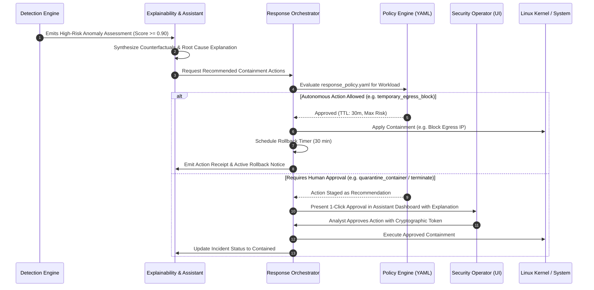

# Vajra (वज्र) Policy-Governed Remediation & Safety Governance

This document specifies the containment primitives, safety rails, time-bound rollbacks, and cryptographic auditability required for the automated corrective action subsystem (`services/responder`).

---

## 1. Safety Principles for Autonomous & Assistant-Guided Remediation

1. **Principle of Non-Destructive First Action**:
   - Prefer non-destructive suspension (`cgroup.freeze`) over immediate termination (`SIGKILL`). Freezing halts malicious processes while preserving memory state for forensic investigation.
2. **Strict Time-to-Live (TTL) & Auto-Rollback**:
   - Every automatic firewall rule, network block, or cgroup freeze is provisioned with a hard TTL (default: 30 minutes). If not explicitly approved or renewed by a human security analyst, the action automatically reverts.
3. **Hardware & Attestation Gating**:
   - If the host TPM attestation or agent binary integrity is in a `failed` state, **all autonomous containment is locked**. The host cannot be trusted to self-remediate safely without risk of kernel corruption or denial of service.
4. **Cryptographic Audit Receipts**:
   - Every executed action produces an immutable audit record containing:
     $$\text{Receipt} = \text{HMAC-SHA256}(\text{ActionID} \,\|\, \text{TargetPID} \,\|\, \text{RuleID} \,\|\, \text{Timestamp} \,\|\, \text{OperatorID})$$

---

## 2. Containment Primitives Specification

| Action | Target | Linux Mechanism | Fallback / Simulation Mode | Reversible |
| :--- | :--- | :--- | :--- | :--- |
| **`FREEZE_CGROUP`** | Malicious workload cgroup | Write `"1"` to `/sys/fs/cgroup/{cgroup}/cgroup.freeze` | Process suspend via `SIGSTOP` | **Yes** (Write `"0"` to unfreeze / `SIGCONT`) |
| **`BLOCK_EGRESS`** | Malicious Remote IP:Port | `nft add rule inet aegis_filter output ip daddr {IP} tcp dport {PORT} drop` | Simulated firewall state in memory / local mock rule | **Yes** (`nft delete rule ...` on TTL expiry) |
| **`TERMINATE_PROCESS`** | Specific Rogue Process Tree | `kill -15 {PID}` $\to$ wait 3s $\to$ `kill -9 {PID}` | Simulated process termination | **No** (Permanent) |
| **`QUARANTINE_CONTAINER`**| Compromised Container | `docker network disconnect bridge {CONTAINER_ID}` | Disconnect mock virtual interface | **Yes** (`docker network connect ...`) |

---

## 3. Response Governance Flow

