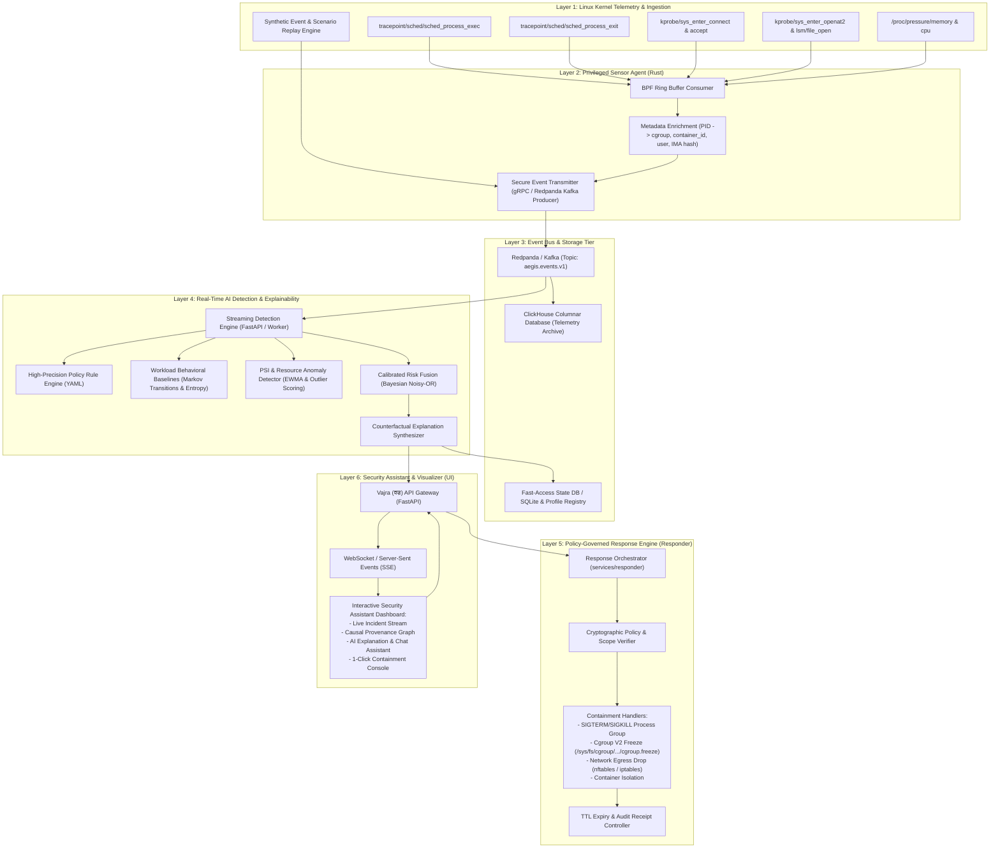

#System Architecture & End-to-End Technical Specification

This document provides the architectural specification for the Vajra (वज्र) platform, connecting Linux kernel telemetry, streaming anomaly detection, explainable AI reasoning, automated policy response, and the operator assistant UI.

---

## 1. System Topology & Data Flow



---

## 2. Component Directory Structure

```text
e:/Competition/cdac1/
├── agent/                         # Rust Privileged Sensor
│   ├── Cargo.toml
│   └── src/
│       ├── main.rs                # Sensor CLI & Ringbuffer Reader
│       ├── enricher.rs            # Procfs, cgroup & container metadata enricher
│       └── simulator.rs           # Deterministic cross-platform scenario generator
├── bpf/                           # eBPF C Kernel Programs
│   ├── aegis_events.h             # Common event header
│   ├── process_trace.bpf.c        # Process exec/exit & path extraction
│   └── network_trace.bpf.c        # Connect/accept socket tracking
├── contracts/                     # Unified Data Contracts
│   └── aegis_event.proto          # Protobuf event definition
├── docs/                          # Architecture & Research Records
│   ├── architecture.md
│   ├── advanced-differentiators.md
│   ├── research-and-algorithms.md
│   ├── system-architecture-spec.md
│   └── remediation-and-safety-governance.md
├── policy/                        # Detection Rules & Response Governance
│   ├── detection/
│   │   ├── temporary_execution.yaml
│   │   ├── reverse_shell.yaml
│   │   ├── credential_tampering.yaml
│   │   └── unverified_binary.yaml
│   └── response/
│       └── response_policy.yaml
├── services/                      # Python Core Services
│   ├── api/                       # API Gateway & Assistant Backend
│   │   └── app/
│   │       ├── main.py            # FastAPI endpoints (Assess, Incidents, Assistant Chat, Remediate)
│   │       ├── models.py          # Unified Pydantic models
│   │       └── assistant.py       # Explainable AI Assistant logic (LLM / RAG / Counterfactuals)
│   ├── detector/                  # Anomaly Detection & Baselining
│   │   └── app/
│   │       ├── domain.py          # Domain data classes
│   │       ├── engine.py          # DetectionEngine with Noisy-OR Fusion
│   │       ├── profiles.py        # Markov Transition & Entropy ProfileStore
│   │       ├── rules.py           # YAML Policy Rule Engine
│   │       ├── reliability.py     # PSI & Memory Leak Anomaly Detector
│   │       ├── counterfactual.py  # Counterfactual Explanation Generator
│   │       └── worker.py          # Real-time event consumer
│   ├── graph/                     # Causal Provenance Graph Service
│   │   └── app/
│   │       ├── lineage.py         # Process & File & Network Provenance DAG builder
│   │       └── exporter.py        # Cytoscape / D3 graph JSON serializer
│   └── responder/                 # Automated Containment & Rollback Service
│       └── app/
│           ├── executor.rs / .py  # Process kill, cgroup freeze, iptables drop
│           ├── policy_check.py    # Policy verification & signature validation
│           └── rollback.py        # TTL timer & automatic rollback scheduler
├── test-lab/                      # Automated Attack & Reliability Scenarios
│   ├── scenario_01_normal_web.py
│   ├── scenario_02_tmp_reverse_shell.py
│   ├── scenario_03_lotl_exfiltration.py
│   ├── scenario_04_memory_leak_oom.py
│   └── scenario_05_attestation_failure.py
└── ui/                            # Interactive Web Assistant Dashboard
    ├── index.html                 # Modern glassmorphism dashboard
    ├── app.js                     # Real-time SSE, interactive graph, AI chat & action triggers
    └── styles.css                 # Premium dark-mode security operations center styling
```
